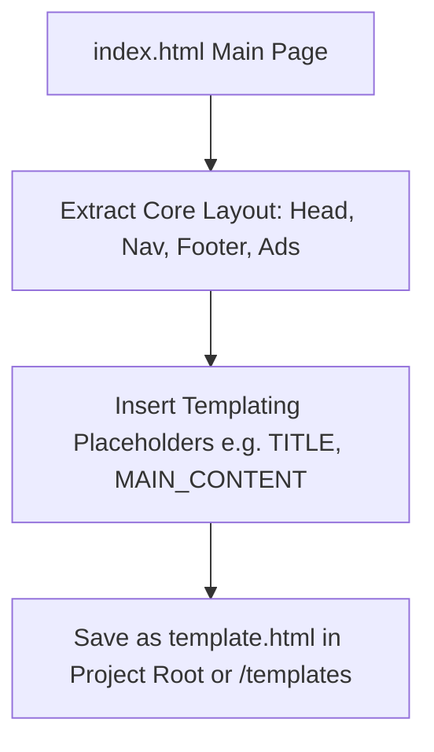

# Plan: Main Page (index.html) Template Extraction

## 1. Overview
The goal is to extract the structure of [`index.html`](index.html:1) and save it as a reusable template file so that new tool pages or subpages can be generated easily with consistent styling, headers, navigation, ad banners, and footers.

## 2. Target Template Structure
The template will be saved as `template.html` (or in a templates directory if specified).

### Key Placeholders to Include:
- `{{TITLE}}`: Page Title
- `{{DESCRIPTION}}`: Meta description
- `{{CANONICAL_URL}}`: Canonical link tag
- `{{OG_TITLE}}`, `{{OG_DESCRIPTION}}`, `{{OG_URL}}`: Open Graph metadata
- `{{HEADER_TITLE}}`: Main header/hero title
- `{{MAIN_CONTENT}}`: Primary dynamic tool or page content
- `{{FAQS}}`: Structured JSON-LD or HTML FAQ accordion section

## 3. Workflow Diagram

## 4. Implementation Steps
1. Create `template.html` base layout file.
2. Verify all path references (like [`ads/ads.css`](ads/ads.css:1), [`ads/ad-config.js`](ads/ad-config.js:1)) match relative path requirements for template instantiation.
3. Validate layout rendering and HTML standards compliance.
